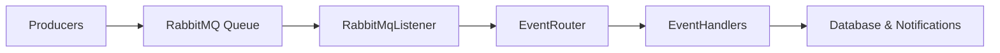

# 📢 Notification Service

**NotificationService** is a microservice responsible for receiving post-related events (like post creation) from RabbitMQ, processing them, and sending notifications to users subscribed to specific channels.

---

## 🏛️ Architecture

- **Producers** send event messages to RabbitMQ (for example, `PostCreated` events).
- **RabbitMqListener** listens to the queue and routes incoming events.
- **EventRouter** dispatches events to the correct **EventHandlers** (example: `PostCreatedHandler`).
- **Services** load necessary user/channel data from the database.
- **Notifications** are prepared for users based on their subscriptions.



---

## ⚙️ Technologies Used

- **.NET 9.0** (ASP.NET Core)
- **Entity Framework Core** + **PostgreSQL**
- **RabbitMQ** (messaging)
- **Docker** & **Docker Compose**
- **Identity** (for users via AspNetUsers table)

---

## 🚀 Running the Service Locally

Make sure you have:
- [.NET 9.0 SDK](https://dotnet.microsoft.com/en-us/download/dotnet/9.0) installed
- [Docker](https://www.docker.com/products/docker-desktop/) installed and running

### 1. Clone the repository

```bash
git clone https://github.com/Vertiigor/NotificationSystem.git
```

### 2. Update appsettings.json

Set your RabbitMQ and Database connection strings in `appsettings.json`.

```json
"ConnectionStrings": {
  "DatabaseContext": "Host=localhost;Port=5432;Database=notifications;Username=postgres;Password=yourpassword"
}
```

### 3. Run with Docker Compose

This project comes with a `docker-compose.yml` to spin up RabbitMQ, PostgreSQL, and the NotificationService easily.

```bash
docker-compose up --build
```

✅ This will start:
- RabbitMQ server
- PostgreSQL database
- NotificationService app

You can access:
- RabbitMQ Management UI: [http://localhost:15672](http://localhost:15672) (default user: `guest` / password: `guest`)
- ASP.NET Core app (NotificationService): [http://localhost:5000](http://localhost:5000)

---

## 📜 Example Event Message (sent to RabbitMQ)

```json
{
  "EventType": "PostCreated",
  "Payload": {
    "PostId": "7f59f30c-98d8-4317-857e-43bf2c447fd5",
    "Title": "Sample text",
    "ChannelId": "979f1862-9e61-4af2-b2ab-e8f5b7854af9",
    "CreatedAt": "2025-04-27T12:24:07.666Z"
  }
}
```

---

## 📦 Project Structure

```
NotificationService/
│
├── Contracts/          # Message envelope and event models
├── Data/               # Database context and migrations
├── EventHandlers/      # Handlers for different event types
├── Services/           # Business logic and RabbitMQ listeners
├── Dockerfile          # Docker build instructions
├── docker-compose.yml  # Multi-container setup
└── README.md           # You're here!
```

---

## 🧠 Future Improvements

- Integration with real notification channels (email, push notifications)
- Health checks and metrics for monitoring

---
